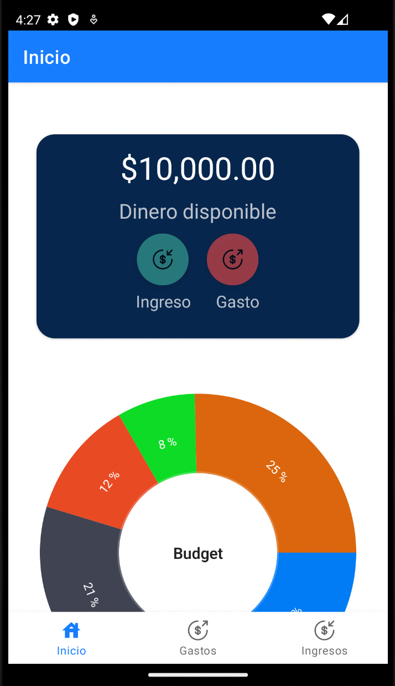
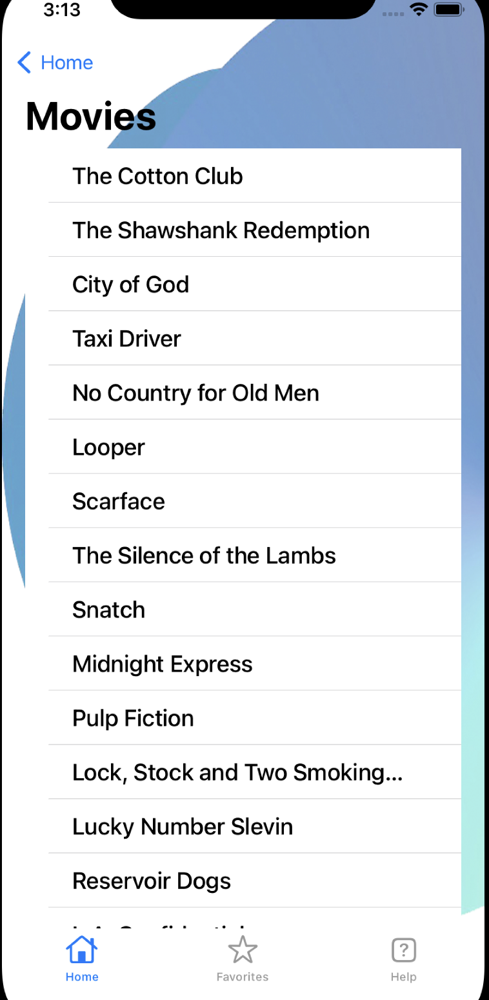
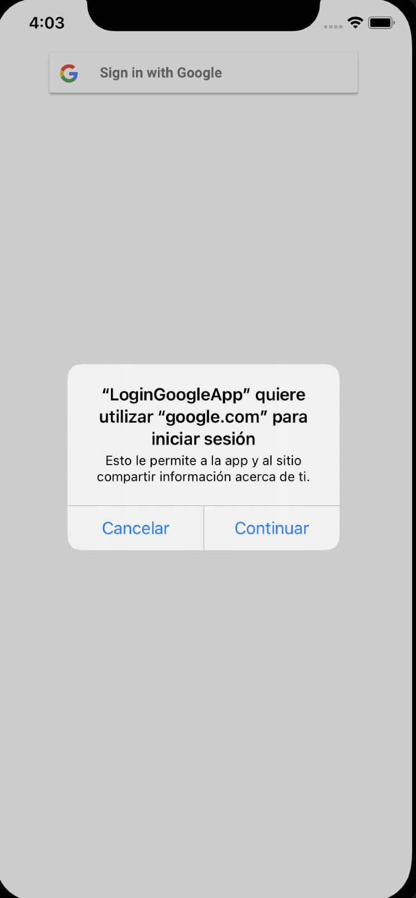

<h1 align="center">Hey! 👋, I'm Osmar</h1>

I'm a Software Engineer passionate about this crazy tech world, currently learning more about Native Mobile Development Apps (Android & iOS) one step at a time 👨‍💻. 

### Languages and Tools 

 
 
 
 

#

### Currently working on

- Android Apps developed using: Android Views (recyclers, cards, scrolls, ...), navigation components, fragments, data persistence like ROOM, manage network connections/resources, Firebase authetication, manage native hardware (camera, gps) and Jetpack Compose.

     

- iOS Apps developed using: UIKit components (navigations, scroll views, table views, ...), data persistence like Core Data, dependency managers (CocoaPods, Carthage and Swift Package Manager), Firebase authentication, manage network connections/resources, manage native hardware (camera, gps) and SwiftUI

      

#

